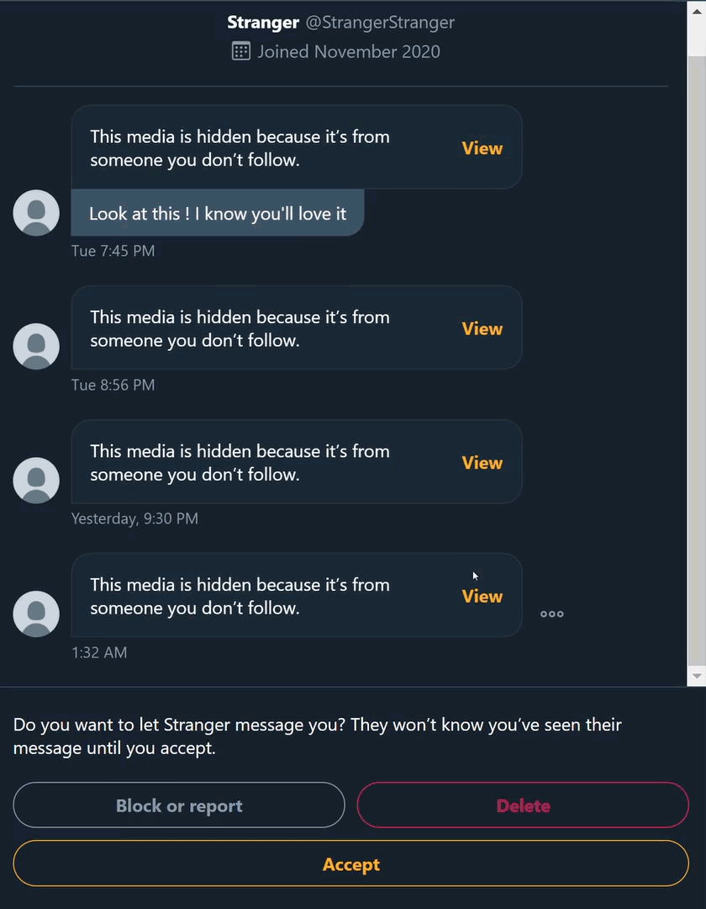

**Twitter** is a social network. We live in a **society**. *What could go **wrong** ?*

Yet everything is not as great as it seems. Unfortunately, some people send questionable medias to strangers, especially women, and that is not okay.

Twitter's safety features are very basic and do not offer the peace of mind some of us wish for.

This extension aims to make it a bit better.

Inspired by [Chloe's post](https://twitter.com/ChloeCondon/status/1328735147617783809) - thank you for bringing it up :) ! 

## Features 

Overview (Note that the GIF is compressed, blur does not look that bad in browser)

### Blur by default
The extension blurs all received media by default, including GIFs and videos. 

It then offers a button right next to the media to toggle the blur on or off.

### Ask an image recognition service for NSFW Categorization
If the blurred image looks suspicious, you can also get an answer from an image recognition service.

When clicking the relevant button, the image is sent to an online recognition service powered by [Imagga](https://imagga.com/) , 
to obtain results about whether or not the image is NSFW. 

[Imagga](https://imagga.com/) is a third party service, and by sending them images you agree to their [privacy policy](https://imagga.com/privacy).

I know that nobody would dare skip reading this kind of document :). 
But just in case : they basically state that no human is involved in the image categorization, and that they value personal privacy. 

## Notes
NSFW Categorization is only available for images, not videos and GIFs. 

### Service choice
Imagga's quota is about 2000 images per month, but is easy to sign up for, 
so users could use the extension with their own API credentials 
in case the ones provided with the extension went over the free quota.

Azure offers a more generous quota of 5000 images per month, and I trust them more regarding privacy,
but they requires a credit card to sign up. 
The average user won't be willing to do so just to use an extension.

I'm thus still debating which one to use in the long run, maybe both.
